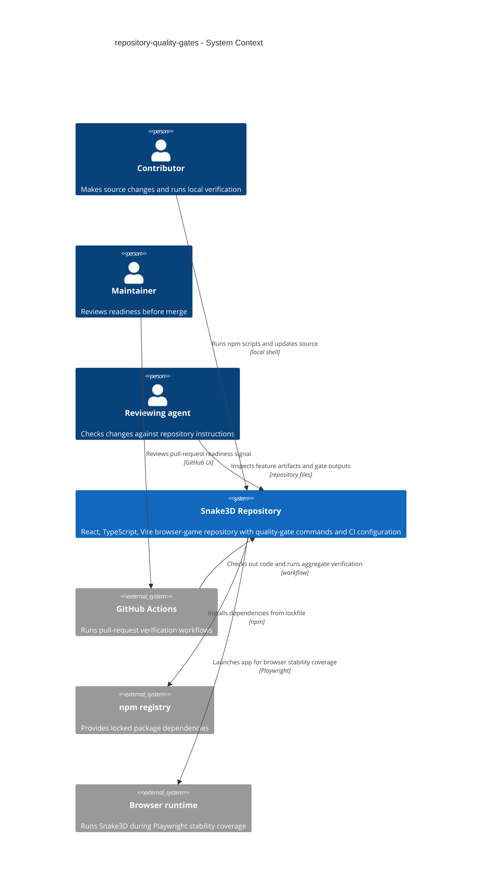
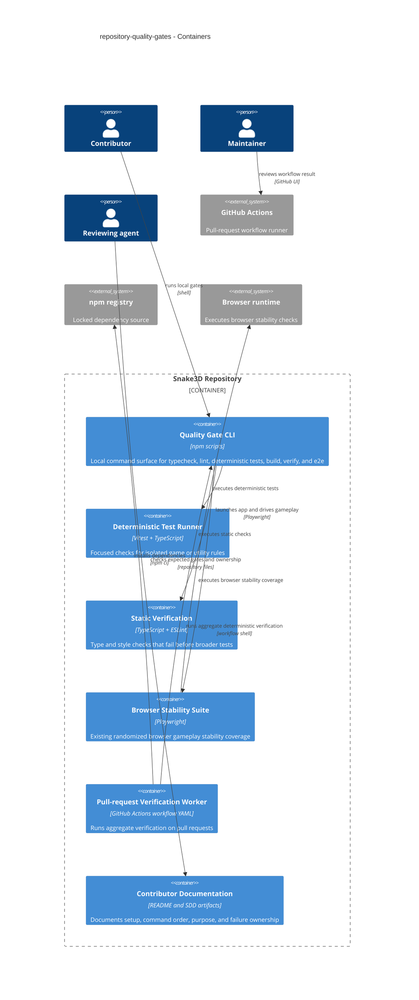
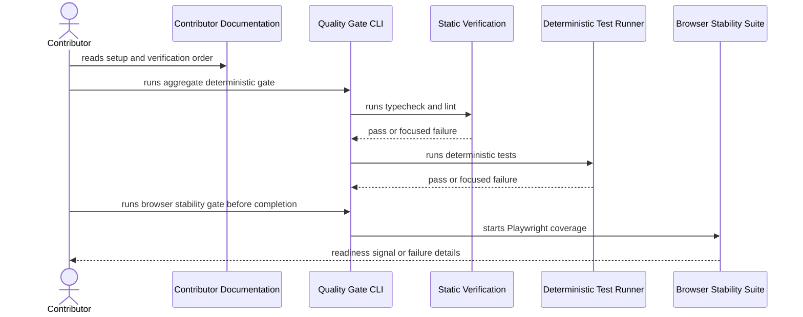
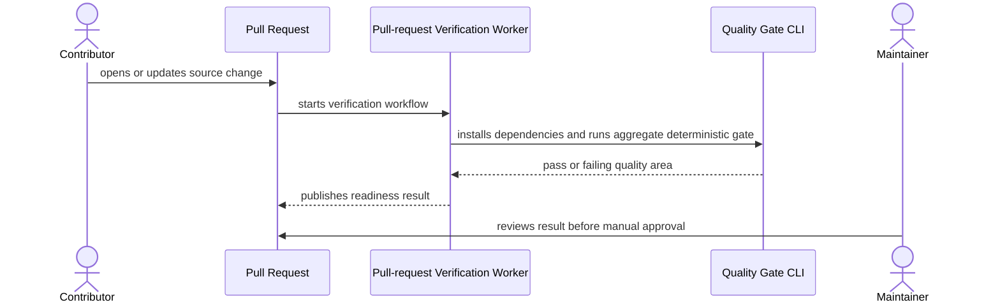

# Software Architecture Document - repository-quality-gates

## 1. Introduction and goals

**Intent.** Repository quality gates give every Contributor one documented local verification path, give every Maintainer a matching pull-request readiness signal, and establish the first deterministic test layer so later Snake3D engine work is not protected only by build and randomized browser stability coverage.

**Top-3 quality goals:**

1. **Fast deterministic feedback** - local deterministic gates run in <= 60 seconds on a warmed developer machine, excluding browser stability coverage.
2. **Parity between local and PR review** - 100% of required local aggregate checks run in pull-request verification.
3. **Clear ownership of failures** - 100% of configured checks have a documented purpose and failure owner.

**Stakeholders.**

| Role | Interest | Sign-off owner? |
|---|---|---|
| Contributor | Runs local commands before asking for review. | No |
| Maintainer | Uses local and pull-request gate results to decide readiness. | Yes |
| Reviewing agent | Checks changes against repository instructions and feature artifacts. | No |
| Tech Lead | Approves the architecture and keeps the gate set aligned with roadmap priorities. | Yes |

## 2. Constraints

**Technical.**
- The app remains React 18, TypeScript, Vite, React Three Fiber, and Three.js.
- Current scripts are `npm run dev`, `npm run build`, `npm run preview`, and `npm run test:e2e`.
- The existing build command runs `tsc && vite build`; the new `typecheck` command must preserve strict TypeScript checking without changing runtime behavior.
- Playwright remains the browser automation harness and the existing `test:e2e` stability check remains part of completion gates.
- There is no backend, database, account system, persistent player profile, or deployment platform in scope.

**Organisational.**
- Feature size is `S`; route is `quick`.
- The implementation should be a small sequence of focused repository-infrastructure changes.
- No gameplay, rendering, controls, level balance, or player-facing UI behavior may change.
- Pull-request readiness is a repository review signal; branch protection policy may be configured outside this repository.

**Conventions.**
- Follow `AGENTS.md`, `README.md`, `docs/architecture-map.md`, and `docs/roadmap.md`.
- Keep source changes scoped and reviewable; do not commit generated folders or local artifacts.
- Use npm scripts as the contributor-facing command interface.
- Keep deterministic game-rule tests isolated from React and Three.js when practical.
- Reuse existing Playwright coverage instead of replacing it.

**Regulatory / external.**
- N/A: this feature changes repository commands and review workflows only; it touches no player data, identity, runtime authorization, or privacy boundary.

## 3. Context and scope

Snake3D is a browser game repository moving toward a commercial MVP. Its current verification surface has a production build and one long browser stability check, but it lacks a deterministic aggregate command, a deterministic test layer, and pull-request verification parity.

<!-- brownfield: architecture map reflects c02fc9f and is stale vs current HEAD d535bb4, so this design also inspected package/config/workflow source files; refresh with survey after implementation if the command surface changes significantly. -->

**External systems (in / out):**

| Actor or system | Type | Interaction |
|---|---|---|
| Contributor | Person | Installs dependencies and runs local npm quality-gate commands. |
| Maintainer | Person | Reviews local and PR gate results before merge decisions. |
| Reviewing agent | Person / automation | Checks that feature work follows repository instructions and active artifacts. |
| GitHub Actions | External system | Runs pull-request verification workflow from repository configuration. |
| npm registry | External system | Supplies locked dependencies during clean checkout and CI install. |
| Browser runtime | External system | Executes the app during Playwright browser stability coverage. |

**C4 Context (L1):**



The diagram shows the feature boundary as repository tooling and workflow configuration, not game runtime behavior. The repository remains the system of record; GitHub Actions is the external runner that executes the same aggregate gate maintainers expect locally.

## 4. Solution strategy

1. **Expose quality gates through npm scripts** - Local verification should be discoverable through `package.json` and documented in `README.md`. A Contributor runs one aggregate command for deterministic checks, while browser stability remains a documented completion gate because it is intentionally slower.
2. **Use Vitest for deterministic TypeScript tests** - The repository already uses Vite and TypeScript, so Vitest gives a focused unit-test layer with minimal toolchain mismatch. Initial tests should target isolated utilities or engine rules that do not require React Three Fiber or a browser.
3. **Mirror local deterministic verification in GitHub Actions** - Pull requests should run dependency install plus the aggregate deterministic command so Maintainers see a readiness signal before manual approval. The workflow should not silently weaken the existing browser stability requirement; if browser coverage is too slow for every PR, that exception must be explicit in documentation and completion rules.
4. **Keep the gate set repository-scoped** - This feature must not introduce a backend, new game loop, second state-management architecture, or new styling system. It adds repository command, test, lint, and CI infrastructure around the existing app.

**Target-surface decision.** This feature targets `cli` and `worker`: npm scripts are the local command-line surface, and GitHub Actions is the pull-request worker surface. It does not target `web-frontend` because no player-facing UI is changed.

## 5. Building block view

The feature extends existing repository infrastructure rather than adding runtime modules. The command layer lives in `package.json`, deterministic checks live beside source/tests using normal TypeScript tooling, documentation lives in `README.md` and feature artifacts, and CI lives under `.github/workflows/`.

**Internal decomposition:**

```text
package.json                         npm script contract for local gates
README.md                            contributor setup and verification guide
.github/workflows/                   pull-request worker configuration
tests/                               deterministic and browser verification suites
src/engine/ or src/commands/          likely homes for focused pure-rule test seeds
docs/features/repository-quality-gates/
  spec.md                            accepted scope and criteria
  sad.md                             this architecture
  adr/                               design decisions with reversal cost
```

**C4 Container (L2):**



The container view keeps CI workflow configuration inside the repository boundary because the repository owns the YAML, while GitHub Actions remains the external execution platform.

## 6. Runtime view

**Critical flow 1: Contributor verifies a local change**



**Critical flow 2: Pull request receives readiness signal**



The `sequences` stage can expand failure branches for type/style failures, deterministic test failures, CI install failures, and browser stability preservation if needed.

## 7. Deployment view

<!-- N/A: reuses the existing repository and GitHub pull-request execution model; no Snake3D runtime deployment or hosting topology changes. -->

The only operational topology change is a repository-owned GitHub Actions workflow file that runs in GitHub-hosted CI for pull requests. Local commands continue to run on contributor machines.

## 8. Crosscutting concepts

| Concept | Convention | Where defined |
|---|---|---|
| Command interface | npm scripts are the stable contributor-facing interface. | `package.json`, `README.md`, ADR-0001 |
| Gate ordering | Run cheap deterministic checks before broader build and browser coverage. | `README.md`, `package.json`, ADR-0001 |
| Deterministic tests | Vitest owns focused unit-style checks for isolated TypeScript rules. | ADR-0002 |
| Browser coverage | Existing Playwright stability test remains part of the documented completion gate. | `README.md`, `AGENTS.md`, spec AC-04 |
| Pull-request verification | GitHub Actions runs the same aggregate deterministic gate expected locally. | `.github/workflows/`, ADR-0003 |
| Failure ownership | Documentation names each configured check's purpose and likely owner. | `README.md`, spec NFR "Aggregate gate clarity" |
| Security and privacy | No product data or runtime authorization boundary is introduced. | spec §6.1 |
| Generated artifacts | `dist/`, `node_modules/`, `playwright-report/`, `test-results/`, screenshots, videos, and traces stay out of Git. | `AGENTS.md`, `.gitignore` |

## 9. Architecture decisions

| # | Title | Status | Section |
|---|---|---|---|
| 0001 | Use npm scripts as the local quality-gate contract | Accepted | §4 |
| 0002 | Use Vitest for deterministic TypeScript tests | Accepted | §4 |
| 0003 | Run aggregate verification in GitHub Actions pull requests | Accepted | §4 |

ADR files live under `docs/features/repository-quality-gates/adr/NNNN-decision-title.md`.

## 10. Quality requirements

**QG-1. Fast deterministic feedback**
- **When:** a Contributor runs the aggregate deterministic gate on a warmed developer machine.
- **Then:** local deterministic gate runtime is <= 60 seconds on a warmed developer machine, excluding browser stability coverage.
- **How verify:** time `npm run verify` after dependencies are installed; keep Playwright browser stability outside that runtime measurement or document a separate full completion command.

**QG-2. Pull-request parity**
- **When:** a Contributor opens or updates a pull request.
- **Then:** pull-request verification parity is 100% of required local aggregate checks run in pull-request verification.
- **How verify:** compare the README quality-gate section, `package.json` scripts, and `.github/workflows/` workflow steps during review.

**QG-3. Gate clarity**
- **When:** a configured check fails locally or in pull-request verification.
- **Then:** aggregate gate clarity is 100% of configured checks have a documented purpose and failure owner.
- **How verify:** README quality-gate section review confirms every check names its purpose, expected command, and likely owner.

**QG-4. Clean checkout setup**
- **When:** a Contributor prepares the project from a clean checkout.
- **Then:** clean checkout setup is <= 3 commands before a Contributor can run the documented gates.
- **How verify:** review setup instructions from a fresh clone using the committed lockfile.

**QG-5. Browser stability preservation**
- **When:** repository quality gates are updated.
- **Then:** browser stability preservation is 100% of existing browser stability checks remain runnable from the documented gate set.
- **How verify:** confirm `npm run test:e2e` remains documented and runnable before implementation review.

## 11. Risks and technical debt

| Risk / debt | Severity | Mitigation | Owner |
|---|---|---|---|
| Existing architecture map may become stale after repository tooling changes. | Low | Refresh with `survey` after significant structural or command-surface changes. | Tech Lead |
| Browser stability test is long and may be too slow for every pull request. | Medium | Keep it documented as a completion gate; make any PR-schedule exception explicit instead of silently dropping coverage. | Maintainer |
| Adding lint can surface many pre-existing style failures. | Medium | Configure ESLint narrowly for TypeScript/React source first and fix the first failing gate before broadening scope. | Tech Lead |
| Unit-test seed may accidentally depend on mutable engine initialization order. | Medium | Start with isolated pure utility or rule functions; document reset requirements before testing mutable engine modules. | Contributor |
| CI parity can drift if README, scripts, and workflow duplicate command lists. | Medium | Make CI call the aggregate npm script instead of hand-copying each check where practical. | Maintainer |
| Branch protection cannot be fully enforced by repository files alone. | Low | Treat workflow status as the repository signal; Maintainer configures required checks in GitHub settings if available. | Maintainer |

**Accepted debt (acceptable in v1, plan to fix later):**
- The feature seeds deterministic tests but does not require complete engine-rule coverage.
- The feature establishes CI verification but does not implement production monitoring, release validation, or runtime analytics.

## 12. Glossary

| Term | Meaning |
|---|---|
| Contributor | A person or agent making a source change in the Snake3D repository. |
| Maintainer | The project owner or reviewer responsible for deciding whether a change is safe to merge. |
| Reviewing agent | An automated or human-assisted reviewer that checks a change against the repository instructions and active feature artifacts. |
| Quality gate | A repeatable verification command or check that must pass before a change is considered ready. |
| Deterministic gate | A quality gate expected to produce the same pass or fail result for the same source state. |
| Pull request | A proposed repository change reviewed before it is merged into the main code line. |
| Clean checkout | A fresh local copy of the repository with dependencies installed from the committed lockfile. |
| Quality Gate CLI | The npm-script command surface contributors use to run local verification. |
| Pull-request Verification Worker | The GitHub Actions workflow surface that runs repository verification for pull requests. |
