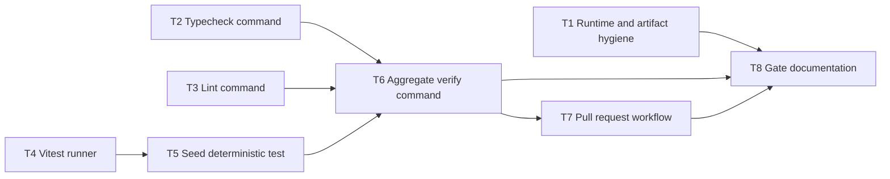

# Epic - repository-quality-gates

> **Spec:** [spec.md](../spec.md) - **Design:** [sad.md](../sad.md) - **ADRs:** [adr/](../adr/)

## Goal

Deliver one repeatable repository quality-gate path for Snake3D contributors, with a matching pull-request readiness signal for maintainers. The epic adds the first deterministic test layer while keeping the existing Playwright browser stability coverage visible as a completion gate.

## Scope

- **In:** npm scripts, TypeScript checking, ESLint, Vitest, seed deterministic tests, GitHub Actions pull-request verification, repository setup and gate documentation.
- **Out:** gameplay, rendering, controls, level balance, player-facing UI, backend services, deployment platforms, production monitoring, and replacement of the existing Playwright browser stability test.

## Task map

## Tasks

See [tracker.md](./tracker.md) for status. Machine contract: [tasks.json](../tasks.json).

| # | Task | Layer | Blocked by | DoD (short) |
|---|---|---|---|---|
| T1 | Pin runtime expectations and artifact hygiene | docs | - | Runtime and generated artifact rules are explicit and consistent. |
| T2 | Extract an explicit TypeScript typecheck gate | app | - | `npm run typecheck` performs strict TypeScript checking without emitting files. |
| T3 | Add a focused ESLint gate | app | - | `npm run lint` checks source and test code with documented ownership. |
| T4 | Add the Vitest deterministic test runner | tests | - | `npm run test:unit` can execute TypeScript unit tests without browser/R3F startup. |
| T5 | Seed focused deterministic coverage | tests | T4 | At least one isolated game or utility rule has a passing deterministic test. |
| T6 | Compose the aggregate deterministic verify command | wiring | T2, T3, T5 | `npm run verify` runs deterministic gates in cheap-to-expensive order. |
| T7 | Add pull-request verification workflow | worker | T6 | Pull requests run dependency install and `npm run verify`. |
| T8 | Document setup, gate order, and completion rules | docs | T1, T6, T7 | README and repository docs agree on setup, gate purposes, CI, and e2e preservation. |

## Risks / Hard rules

- Do not change Snake3D gameplay, rendering, controls, level balance, or player-facing UI; see [spec.md](../spec.md) section 3 and [sad.md](../sad.md) section 2.
- Keep Playwright browser stability coverage runnable and documented as a completion gate; see [spec.md](../spec.md) AC-04 and [sad.md](../sad.md) QG-5.
- CI should call the aggregate npm script instead of duplicating the check list; see [adr/0003-run-aggregate-verification-in-github-actions-pull-requests.md](../adr/0003-run-aggregate-verification-in-github-actions-pull-requests.md).
- Use npm scripts as the contributor-facing contract; see [adr/0001-use-npm-scripts-as-the-local-quality-gate-contract.md](../adr/0001-use-npm-scripts-as-the-local-quality-gate-contract.md).
